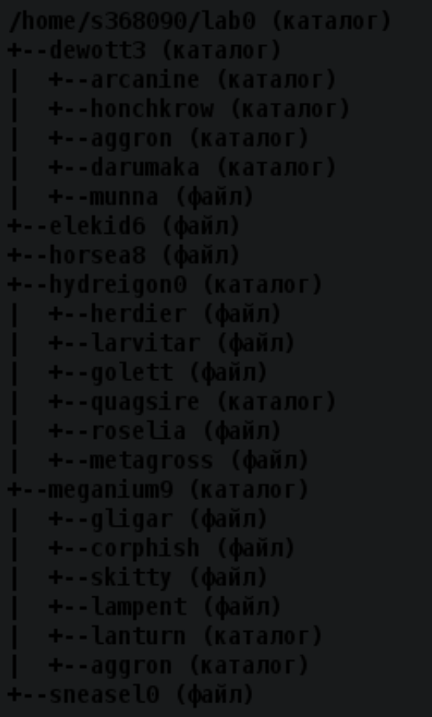
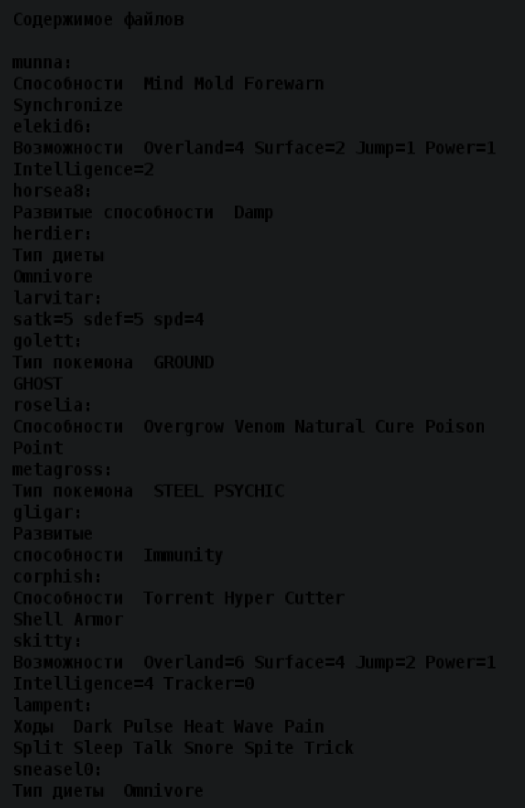

# Laboratory work 1

|variant|.pdf|.docx|
|---|---|---|
| 3107 | [report](./docs/report.pdf) | [report](./docs/report.docx) |

```css
1. Создать приведенное в варианте дерево каталогов и файлов с содержимым. 
В качестве корня дерева использовать каталог *lab0* своего домашнего каталога. 
Для создания и навигации по дереву использовать команды: mkdir, echo, cat, touch, ls, pwd, cd, more, cp, rm, rmdir, mv. 
```
|part1|part2|
|-|-|
|  |  |
```css
2. Установить согласно заданию права на файлы и каталоги при помощи команды chmod, используя различные способы указания прав.

    dewott3: владелец должен читать директорию и переходить в нее; группа-владелец должна читать, записывать директорию и переходить в нее; остальные пользователи должны читать, записывать директорию и переходить в нее
    arcanine: rwx-wxrw-
    honchkrow: rwx-wx-wx
    aggron: rwx-wxrw-
    darumaka: владелец должен читать директорию и переходить в нее; группа-владелец должна читать, записывать директорию и переходить в нее; остальные пользователи должны записывать директорию и переходить в нее
    munna: rw--w--w-
    elekid6: ------rw-
    horsea8: права 066
    hydreigon0: права 755
    herdier: владелец должен читать файл; группа-владелец должна не иметь никаких прав; остальные пользователи должны не иметь никаких прав
    larvitar: права 660
    golett: права 066
    quagsire: rwxr-x-wx
    roselia: права 440
    metagross: владелец должен читать и записывать файл; группа-владелец должна не иметь никаких прав; остальные пользователи должны читать файл
    meganium9: -wx--x--x
    gligar: rw-------
    corphish: r--------
    skitty: rw----r--
    lampent: права 064
    lanturn: rwx-wxrwx
    aggron: владелец должен читать директорию и переходить в нее; группа-владелец должна читать, записывать директорию и переходить в нее; остальные пользователи должны читать, записывать директорию и переходить в нее
    sneasel0: права 444

3. Скопировать часть дерева и создать ссылки внутри дерева согласно заданию при помощи команд cp и ln, а также комманды cat и перенаправления ввода-вывода.

    объеденить содержимое файлов lab0/hydreigon0/roselia, lab0/hydreigon0/golett, в новый файл lab0/elekid6_47
    cоздать символическую ссылку для файла sneasel0 с именем lab0/hydreigon0/metagrosssneasel
    скопировать содержимое файла elekid6 в новый файл lab0/meganium9/lampentelekid
    скопировать файл sneasel0 в директорию lab0/dewott3/aggron
    создать символическую ссылку c именем Copy_36 на директорию dewott3 в каталоге lab0
    скопировать рекурсивно директорию meganium9 в директорию lab0/meganium9/aggron
    cоздать жесткую ссылку для файла horsea8 с именем lab0/hydreigon0/metagrosshorsea

4. Используя команды cat, wc, ls, head, tail, echo, sort, grep выполнить в соответствии с вариантом задания поиск и фильтрацию файлов, каталогов и содержащихся в них данных.

    Рекурсивно подсчитать количество символов содержимого файлов из директории lab0, имя которых заканчивается на '0', отсортировать вывод по увеличению количества, ошибки доступа не подавлять и не перенаправлять
    Вывести список имен и атрибутов файлов в директории dewott3, список отсортировать по возрастанию размера, ошибки доступа не подавлять и не перенаправлять
    Вывести содержимое файлов: munna, herdier, larvitar, golett, roselia, metagross, gligar с номерами строк, исключить строки, содержащие "ve", ошибки доступа не подавлять и не перенаправлять
    Вывести рекурсивно список имен и атрибутов файлов в директории lab0, начинающихся на символ 'h', список отсортировать по убыванию размера, ошибки доступа перенаправить в файл в директории /tmp
    Вывести рекурсивно список имен и атрибутов файлов в директории hydreigon0, список отсортировать по убыванию даты доступа к файлу, подавить вывод ошибок доступа
    Подсчитать количество символов содержимого файла sneasel0, результат дописать в тот-же файл, ошибки доступа не подавлять и не перенаправлять

5. Выполнить удаление файлов и каталогов при помощи команд rm и rmdir согласно варианту задания.

    Удалить файл elekid6
    Удалить файл lab0/hydreigon0/herdier
    удалить символические ссылки Copy_*
    удалить жесткие ссылки lab0/hydreigon0/metagrosshors*
    Удалить директорию hydreigon0
    Удалить директорию lab0/meganium9/lanturn
```


