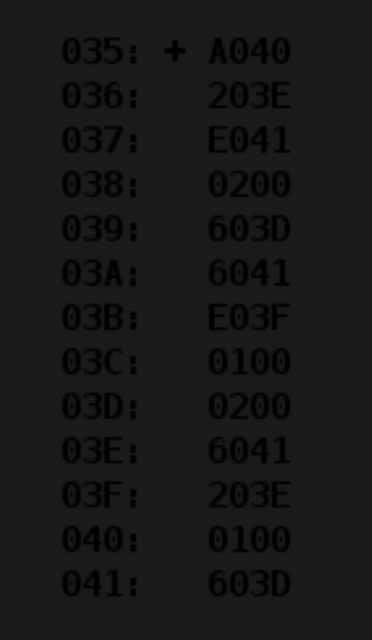

# Laboratory work 2
```python
Based on the variant given by the teacher, determine the function computed by the program, 
its domain and range of permissible values for input and output data. 
Trace the program and suggest a version with fewer commands. 
When completing the task, represent the result and all operands of arithmetic operations as signed numbers, 
and logical operations as a set of sixteen logical values.
```
# Var 3107
|.pdf|.docx | programm |
|---|---|---|
| [report](./docs/report.pdf) | [report](./docs/report.docx) | [programm](./programm.asm)|



