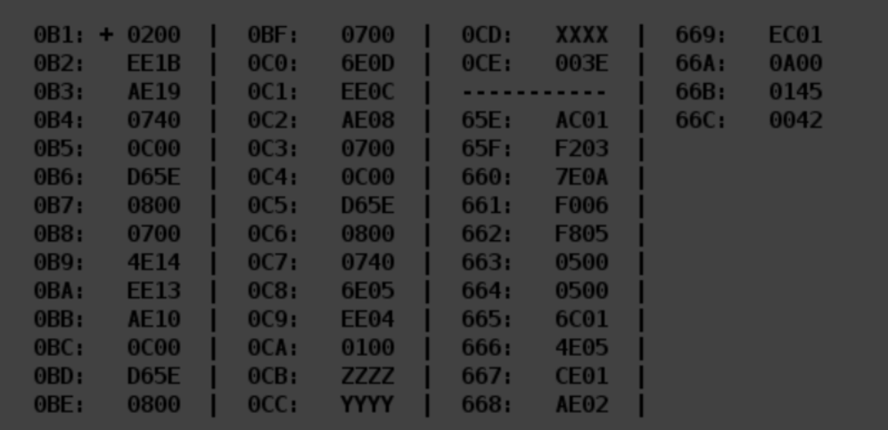

# Laboratory work 4
```python
Based on the variant given by the teacher, restore the text of the given program, 
determine its purpose, and write a program description. 
Determine:
- the domain of representation
- the range of allowable values for the input data and result. 
Also, perform a program tracing
```
# Var 3104
|.pdf|.docx | programm | additional_task |
|---|---|---|---|
| [report](./docs/report.pdf) | [report](./docs/report.docx) | [programm](./programm.asm) | [additional_task](./additional_task.asm)|


