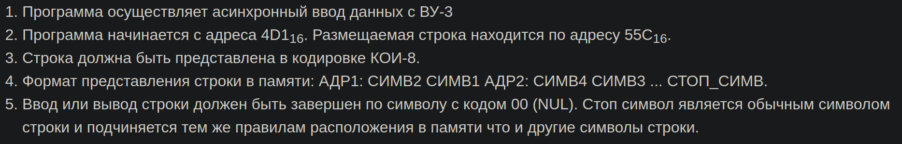

# Laboratory work 5
```python
Based on the assignment provided by the instructor, 
develop a program for asynchronous data exchange with an external device.   
Using the program, perform input or output of information,
using a readiness signal (button) of the external device as confirmation of the data.
```
# Var 3102
|.pdf|.docx | additional_task |
|---|---|---|
| [report](./docs/report.pdf) | [report](./docs/report.docx) | [additional_task](./additional_task.asm)|




## Additional task
```python
Вводить с `ВУ Клавиатура` символы. 
Каждый введённый символ должен тут же отображаться на `ВУ Текстовый принтер`(прерывание). 
Если ввести `echo something`, то команда должна отработать как echo в линуксе, т.е. вывести `something`.
```
