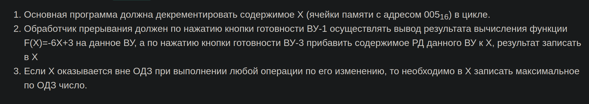

# Laboratory work 6
```python
Based on the variant given by the teacher, develop and explore the operation of a data exchange software complex
in interrupt mode. The main program should modify the contents of a specified memory cell (X), which should be 
represented as a signed number. The range of allowable values for changing X should be limited by a given function
F(X) and the design features of the data register of external device(ВУ) (8-bit signed representation). 
The interrupt processing program should output the modified value of X to the data register of external device(ВУ)
according to the assignment variant, as well as ignore all unprocessed interrupts.
```
# Var 3105
|.pdf|.docx | additional_task |
|---|---|---|
| [report](./docs/report.pdf) | [report](./docs/report.docx) | [additional_task](./additional_task.asm)|



## Additional task
```python
Вводить с `ВУ Клавиатура` символы. 
Каждый введённый символ должен тут же отображаться на `ВУ Текстовый принтер`(прерывание). 
Если ввести `echo something`, то команда должна отработать как echo в линуксе, т.е. вывести `something`.
```
