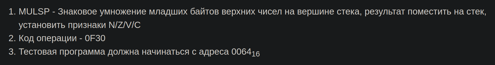

# Laboratory work 7
```python
Synthesize the execution cycle for commands issued by the teacher. Develop test programs that verify each of the synthesized
commands. Load the execution cycles of the synthesized commands into the microprogram memory of the BESM computer, and load the
test programs into the main memory of the BESM computer. Verify and debug the developed test programs and microprograms.
```
# Var 3100
|.pdf|.docx | additional_task |
|---|---|---|
| [report](./docs/report.pdf) | [report](./docs/report.docx) | [additional_task](./additional_task.asm)|



## Additional task
```python
Пока что доп не дали :)
```
